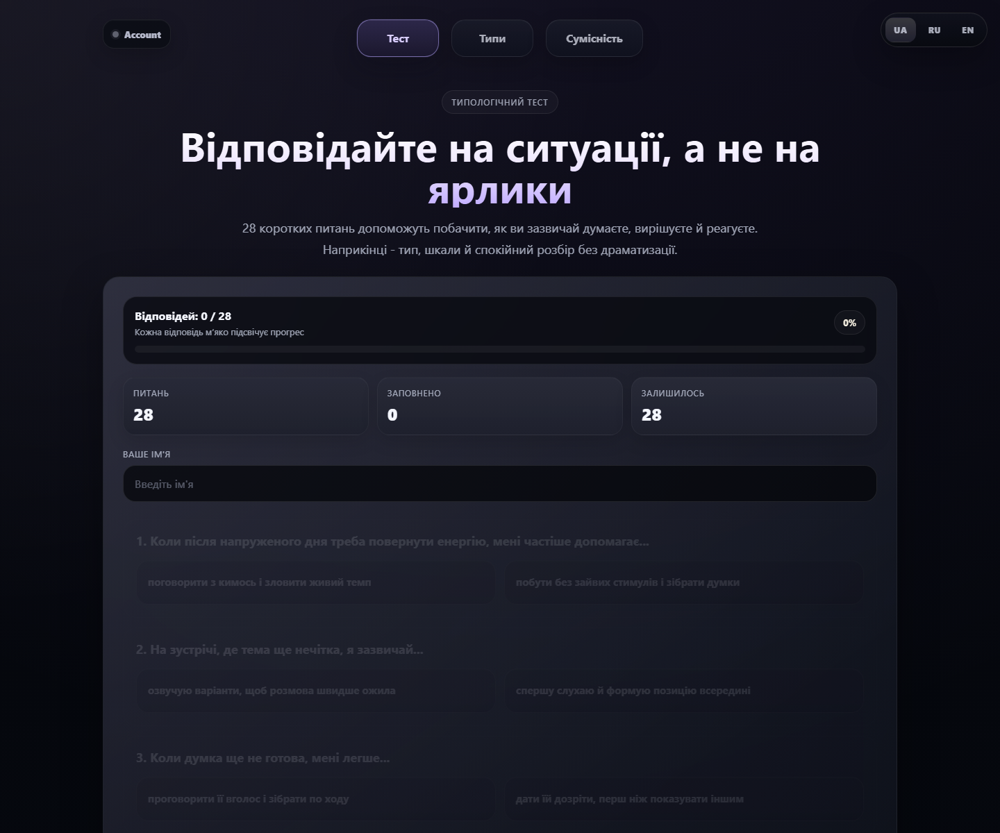
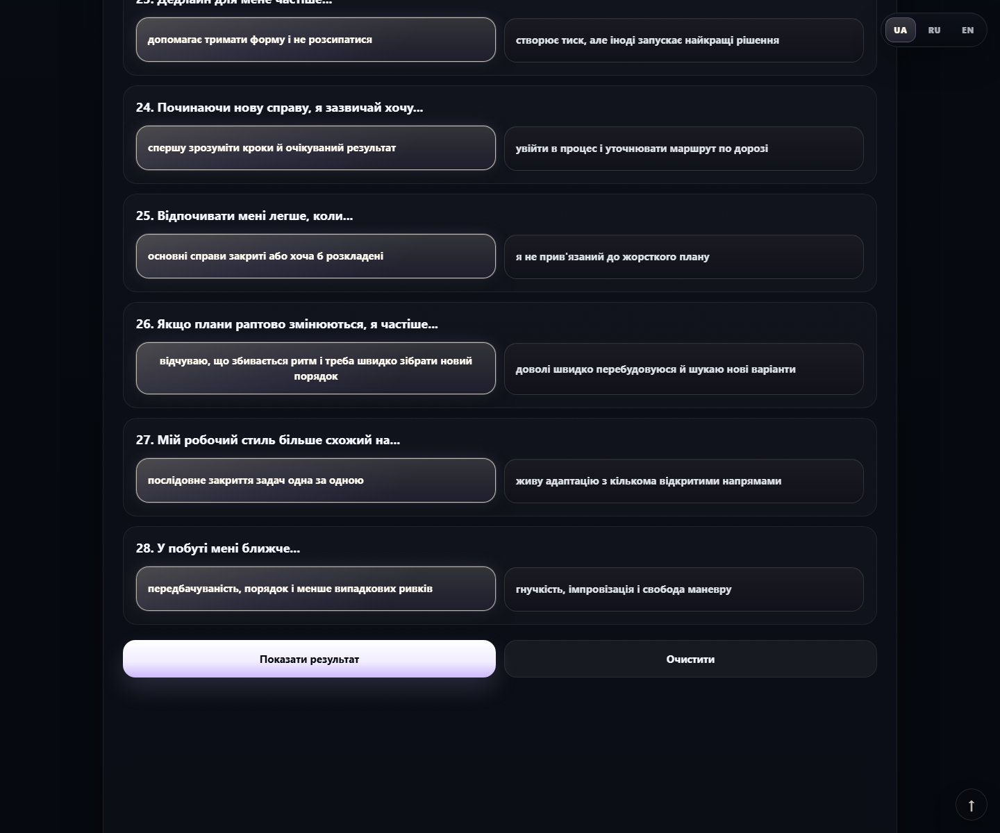
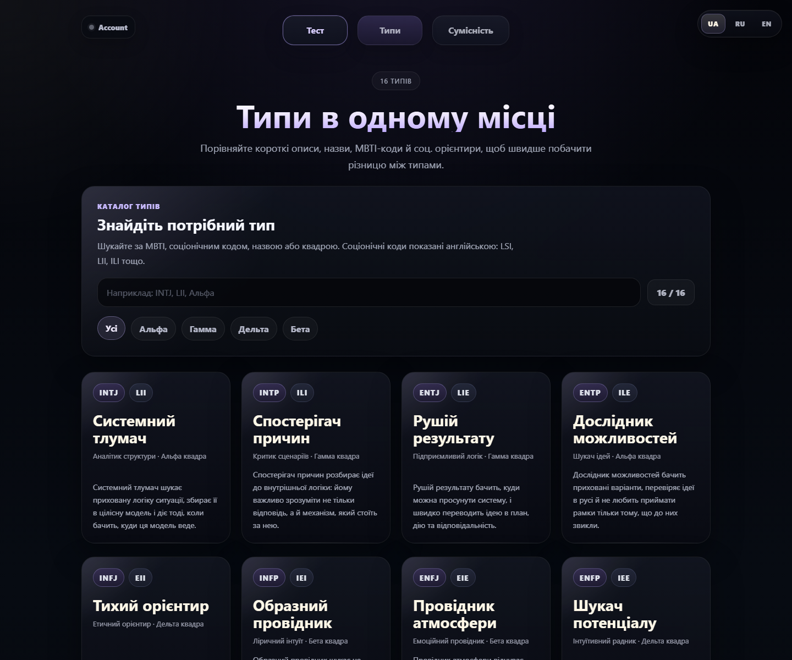
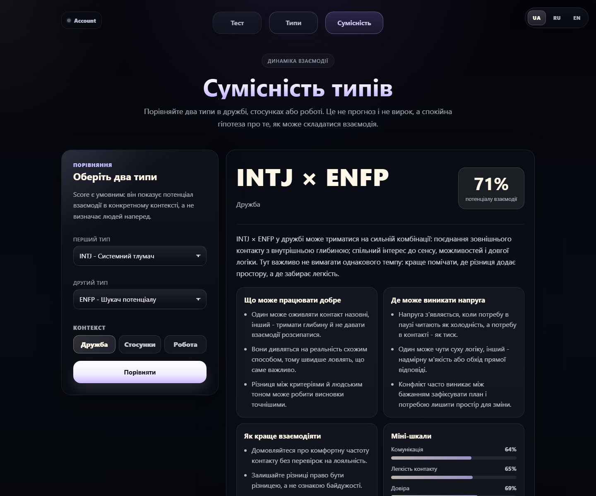
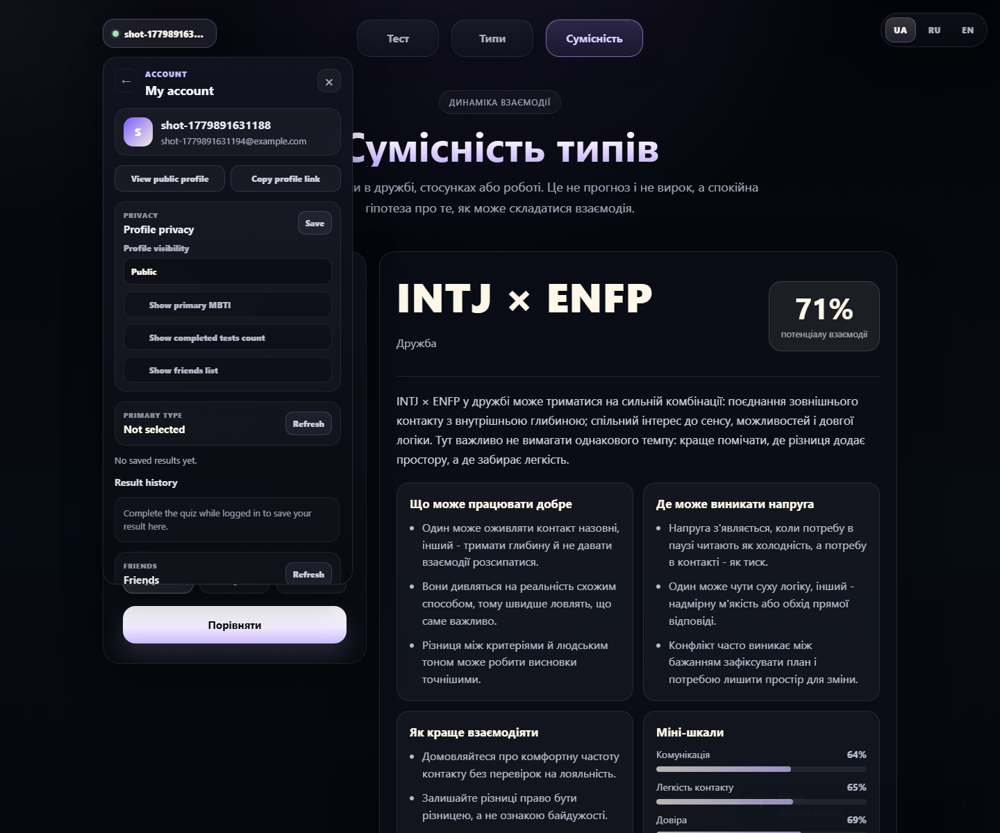
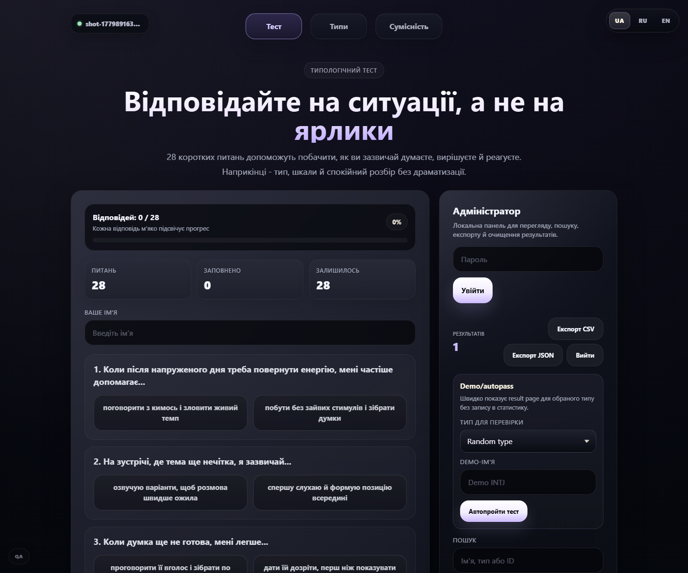

# Personality Type Test

[](https://github.com/lqhiyul/personality-type-test/actions/workflows/go.yml)


A portfolio full-stack MBTI-style quiz application with a Go backend, vanilla JavaScript frontend, SQLite-backed accounts/social features, cookie sessions, CSRF protection, admin exports, and Playwright smoke tests.

Live demo: [personality-type-test-69d9.onrender.com](https://personality-type-test-69d9.onrender.com)

The Render free plan may sleep after inactivity, so the first request can take 30-60 seconds. This is an educational portfolio project, not a clinical personality assessment.

## For Backend Reviewers

Start here:

- Entrypoint: `cmd/server/main.go`
- Server wiring: `internal/app/server.go`
- Route registration: `internal/app/handlers.go`
- JSON response helpers: `internal/app/http_helpers.go`
- User auth flow: `internal/app/user_auth_handlers.go`
- Admin auth and exports: `internal/app/admin_handlers.go`
- Admin audit logging: `internal/app/admin_audit.go`
- Sessions: `internal/sessions/store.go`
- SQLite setup and migrations: `internal/storage/sqlite/sqlite.go`
- App-facing stores: `internal/app/*_store.go`
- Scoring rules: `internal/scoring/scoring.go`
- Migrations: `migrations/` and embedded copies in `internal/storage/sqlite/migrations/`
- Security model: `docs/security.md`
- API documentation: `docs/api.md`
- Reviewer guide: `docs/reviewer-guide.md`
- Tests: `internal/app/*_test.go`, `internal/sessions/store_test.go`, `internal/storage/sqlite/sqlite_test.go`
- CI: `.github/workflows/go.yml`, `.github/workflows/codeql.yml`

The only server entrypoint is `cmd/server/main.go`; there is no duplicate root `main.go`.

## What This Demonstrates

- Go HTTP server using `net/http` and explicit route composition.
- User registration/login/logout/current-user flow.
- Bcrypt password hashing with normalized username/email handling.
- SQLite-backed cookie sessions with hashed tokens, expiry, and revocation.
- CSRF protection for unsafe methods through a double-submit cookie/header flow.
- Login rate limiting with trusted-proxy-aware client IP handling.
- Security headers, request IDs, and request logging middleware.
- SQLite persistence for users, sessions, profiles, saved results, friendships, comments, messages, blocks, reports, and admin audit logs.
- Versioned deterministic migrations with idempotent migration tests.
- JSON persistence for anonymous quiz submissions and admin CSV/JSON export.
- Handler/store/API contract tests, race-testable packages, and Playwright smoke tests.
- CI with gofmt, vet, staticcheck, Go tests with coverage, race tests, JS checks, Playwright, Docker build, Dependabot, and CodeQL.
- Dockerfile and docker-compose support for local/container review.

## Screenshots

| Home | Result |
| --- | --- |
|  |  |

| Types | Compatibility |
| --- | --- |
|  |  |

| Profile | Admin |
| --- | --- |
|  |  |

## Features

- 32-question MBTI-style quiz with slider-weighted scoring, result breakdown, and localized frontend chrome.
- Anonymous result submission to JSON storage.
- User accounts with saved result history, primary result selection, and public profile controls.
- Public profiles, profile comments, friends, compatibility, private conversations, blocks, and reports.
- Admin panel for anonymous result review, statistics, CSV/JSON export, report review, delete, and clear actions.
- Local seed command for fake demo users and results.

## Quick Start

Prerequisites:

- Go 1.25+
- Node.js 20+ for JS checks/E2E
- Docker optional
- `staticcheck` is run through a pinned `go run` command in CI/Makefile; a global install is optional
- Race tests require a CGO-enabled Go toolchain

Run locally:

```bash
cp .env.example .env
go run ./cmd/server
```

Open `http://localhost:8080`.

Admin tools are hidden by default. Open `http://localhost:8080/?admin=1` and log in with `ADMIN_PASSWORD` from `.env`.

The app applies SQLite migrations on startup. To run them explicitly:

```bash
go run ./cmd/migrate
```

Seed local fake users only in development:

```bash
go run ./cmd/seed
```

## Common Commands

```bash
go run ./cmd/server
go run ./cmd/migrate
go run ./cmd/seed
go test ./...
go test -race ./...
go test ./... "-coverprofile=coverage.out"
go tool cover "-func=coverage.out"
npm run js-check
npm run e2e
```

Optional Makefile targets, when `make` is available:

```bash
make fmt
make vet
make staticcheck
make test
make race
make coverage
make build
make run
make migrate
make seed
make js-check
make e2e
make docker-build
make check
make full-check
```

`make check` runs the regular local quality gate without rewriting files. `make full-check` also runs race tests, coverage, Playwright E2E, and Docker build. Docker checks require a running Docker daemon.

Install Playwright browsers once before local E2E runs:

```bash
npx playwright install chromium
```

## Docker

```bash
docker build -t personality-type-test .
docker run --rm -p 8080:8080 -e HOST=0.0.0.0 -e ADMIN_PASSWORD="strong-password" personality-type-test
```

With Compose:

```bash
cp .env.example .env
docker compose up --build
```

`docker-compose.yml` mounts a named volume for `/app/data` so SQLite and JSON runtime data survive container restarts.

## Configuration

| Variable | Default | Purpose |
| --- | --- | --- |
| `HOST` | `127.0.0.1` in `.env.example` | Bind host. Use `0.0.0.0` for containers/LAN testing. |
| `PORT` | `8080` | HTTP port. |
| `ADDR` | empty | Exact address override. |
| `ADMIN_PASSWORD` | `change-me` | Demo admin password. Must be changed in production mode. |
| `DATA_FILE` | `data/results.json` | JSON file for anonymous submissions. |
| `DATABASE_PATH` | `data/app.db` | SQLite database path. |
| `COOKIE_SECURE` | `false` | Set `true` behind HTTPS. Required in production mode. |
| `PRODUCTION` / `APP_ENV` | `false` / `development` | Enables production safety validation. |
| `TRUSTED_PROXY_CIDRS` | empty | Comma-separated trusted proxy CIDRs for `X-Forwarded-For`. |

Runtime files under `data/`, coverage files, Playwright reports, `node_modules/`, and local build artifacts are ignored by Git.

## Architecture Decisions / Trade-Offs

- SQLite keeps the project easy to clone, run, and review without external services. It is enough for a single-instance portfolio demo, but not the right storage choice for high-write multi-replica production.
- Cookie sessions are used instead of JWT because the app is server-rendered/static-frontend plus same-origin API. Server-side revocation, expiry, and hashed token storage are simpler to reason about for this scope.
- Vanilla JavaScript keeps the frontend dependency surface small and lets the backend remain the main review target. The frontend is modular enough for this app without adding React/Vue build tooling.
- CSRF uses a double-submit token: a readable `csrf_token` cookie plus `X-CSRF-Token` header on unsafe requests. Auth/session cookies remain HttpOnly.
- Admin auth is intentionally simple: one configured admin password with SQLite-backed admin sessions and audit logs. Production multi-admin use should replace this with per-admin accounts, MFA, and RBAC.
- Anonymous quiz submissions stay in JSON because they power a simple demo/admin export flow. Authenticated user data is stored in SQLite.

## Security Summary

- Passwords are bcrypt-hashed.
- Raw session tokens are never stored in SQLite; only SHA-256 hashes are persisted.
- Sessions have expiry and logout revocation.
- Unsafe API methods require CSRF tokens.
- Login attempts are rate-limited by client IP.
- Production mode rejects the default admin password and requires secure cookies.
- Admin login/export/delete/report-review actions are written to `admin_audit_logs`.

See [docs/security.md](docs/security.md) and [docs/deployment.md](docs/deployment.md) for the full checklist.

## API Documentation

- Human-readable contract: [docs/api.md](docs/api.md)
- Partial OpenAPI contract covering primary review paths: [docs/openapi.yaml](docs/openapi.yaml)

The API uses a consistent error shape:

```json
{
  "error": "authentication required"
}
```

## Known Limitations

- SQLite is suitable for a portfolio/single-instance demo, but not high-write multi-replica production.
- Admin auth is intentionally simple and not a full multi-admin RBAC system.
- Admin audit logs are append-only database rows, not a full compliance/audit product.
- MBTI-style output is educational/entertainment content, not clinical or medical guidance.
- Observability is limited to request logs, request IDs, tests, and CI; there are no metrics/traces dashboards.
- `docs/openapi.yaml` is intentionally focused on primary review endpoints; `docs/api.md` is the more complete endpoint reference.
- Local `go test -race ./...` requires CGO. On Windows, install a C toolchain and enable CGO or rely on the Linux CI race job.

## Repository Notes

- Architecture: [docs/architecture.md](docs/architecture.md)
- Development guide: [docs/development.md](docs/development.md)
- Deployment guide: [docs/deployment.md](docs/deployment.md)
- Reviewer guide: [docs/reviewer-guide.md](docs/reviewer-guide.md)
- Troubleshooting: [docs/troubleshooting.md](docs/troubleshooting.md)
- Changelog: [CHANGELOG.md](CHANGELOG.md)
- Release checklist: [RELEASE_CHECKLIST.md](RELEASE_CHECKLIST.md)
