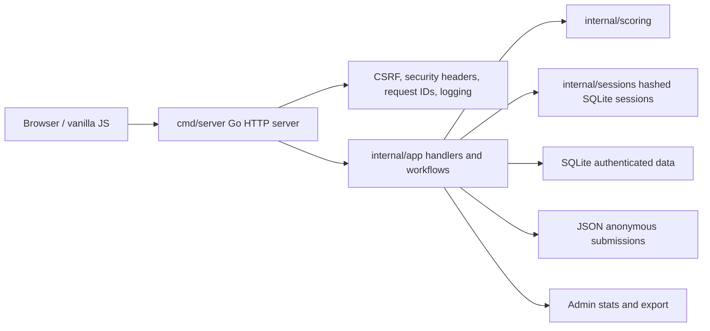

# Personality Type Test

[](https://github.com/lqhiyul/personality-type-test/actions/workflows/go.yml)


A portfolio-grade full-stack MBTI-style quiz with a Go backend, vanilla JavaScript frontend, SQLite-backed accounts/social features, JSON anonymous submissions, admin exports, and browser smoke tests.

**Live demo:** [personality-type-test-69d9.onrender.com](https://personality-type-test-69d9.onrender.com)

The Render free plan may sleep after inactivity, so the first request can take 30-60 seconds. This is an educational portfolio project, not a clinical personality assessment.

## What This Demonstrates

- Clean Go project structure with `cmd/server`, `cmd/migrate`, `cmd/seed`, and focused packages under `internal/`.
- Secure cookie auth basics: bcrypt passwords, persistent hashed SQLite sessions, CSRF protection, SameSite cookies, security headers, and safe proxy-aware rate limiting.
- Vanilla JavaScript app organization with centralized API behavior, CSRF-aware requests, and practical Playwright E2E smoke coverage.
- SQLite persistence for accounts, sessions, profiles, friends, comments, messages, blocks, reports, and user result history.
- JSON persistence for anonymous quiz submissions and admin export/statistics workflows.
- CI with gofmt, vet, staticcheck, tests, race tests, coverage, JS syntax checks, Playwright, Docker build, Dependabot, and CodeQL.

## Screenshots

| Home | Result |
| --- | --- |
|  |  |

| Types | Compatibility |
| --- | --- |
|  |  |

| Profile | Admin |
| --- | --- |
|  |  |

## Features

- 28-question MBTI-style quiz with result breakdown and localized frontend content.
- Anonymous result submission to JSON storage.
- User registration, login, logout, profile settings, and saved result history.
- Public profiles, profile comments, friends, compatibility, private conversations, blocks, and reports.
- Admin panel with result review, statistics, CSV/JSON export, report review, delete, and clear actions.
- Static frontend served by Go, Docker support, migration/seed commands, and local Playwright E2E tests.

## Architecture



More detail: [docs/architecture.md](docs/architecture.md), [docs/api.md](docs/api.md), [docs/security.md](docs/security.md).

## Quick Start

```bash
cp .env.example .env
go run ./cmd/server
```

Open `http://localhost:8080`.

Admin tools are hidden by default. Open `http://localhost:8080/?admin=1` and log in with `ADMIN_PASSWORD`.

## Configuration

| Variable | Default | Purpose |
| --- | --- | --- |
| `HOST` | empty | Bind host, for example `127.0.0.1` locally or `0.0.0.0` in containers. |
| `PORT` | `8080` | HTTP port. |
| `ADDR` | empty | Exact address override. |
| `ADMIN_PASSWORD` | `change-me` | Demo admin password. Must be changed in production mode. |
| `DATA_FILE` | `data/results.json` | JSON file for anonymous submissions. |
| `DATABASE_PATH` | `data/app.db` | SQLite database path. |
| `COOKIE_SECURE` | `false` | Set `true` behind HTTPS. Required in production mode. |
| `PRODUCTION` / `APP_ENV` | `false` / `development` | Enables production safety validation. |
| `TRUSTED_PROXY_CIDRS` | empty | Comma-separated trusted proxy CIDRs for `X-Forwarded-For`. |

Runtime data is ignored by Git. The JSON result file and SQLite database are created automatically when the app first needs them.

## Common Commands

```bash
go run ./cmd/server
go run ./cmd/migrate
go run ./cmd/seed
npm run js-check
npm run e2e
```

Optional Makefile targets, when `make` is available:

```bash
make fmt
make vet
make staticcheck
make test
make race
make coverage
make js-check
make e2e
make docker-build
make check
```

Install Playwright browsers once before local E2E runs:

```bash
npx playwright install chromium
```

## Docker

```bash
docker build -t personality-type-test .
docker run --rm -p 8080:8080 -e HOST=0.0.0.0 -e ADMIN_PASSWORD="strong-password" personality-type-test
```

Mount `/app/data` for durable SQLite/JSON storage.

## Migrations And Seed Data

Migrations are versioned SQL files in `migrations/` and embedded for deployment from `internal/storage/sqlite/migrations/`. Applied versions are tracked in `schema_migrations`.

```bash
go run ./cmd/migrate
go run ./cmd/seed
```

`cmd/seed` creates safe fake local users and refuses to run in production mode.

## Security Summary

- Passwords are bcrypt-hashed.
- Session tokens are stored only as hashes in SQLite.
- Unsafe methods require CSRF tokens.
- Login rate limiting uses a safe proxy-aware client IP resolver.
- Security headers are set by middleware.
- Production mode rejects the default admin password and requires secure cookies.

See [docs/security.md](docs/security.md) and [docs/deployment.md](docs/deployment.md) for the full checklist.

## Known Limitations

- `ADMIN_PASSWORD` is a simple demo/admin model, not a multi-admin RBAC system.
- SQLite is suitable for this portfolio app and small deployments, but not multi-replica high-write workloads.
- MBTI-style output is educational/entertainment content, not clinical guidance.

## Repository Notes

- Development guide: [docs/development.md](docs/development.md)
- Deployment guide: [docs/deployment.md](docs/deployment.md)
- Troubleshooting: [docs/troubleshooting.md](docs/troubleshooting.md)
- Changelog: [CHANGELOG.md](CHANGELOG.md)
