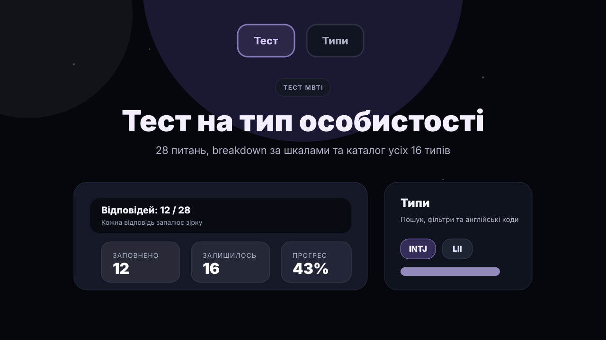

# Personality Type Test

[](https://github.com/lqhiyul/personality-type-test/actions/workflows/go.yml)


**Live Demo:** [personality-type-test-69d9.onrender.com](https://personality-type-test-69d9.onrender.com)

Note: The Render free plan may spin down after inactivity, so the first request can take 30–60 seconds.

A lightweight full-stack personality type test with a Go HTTP backend, modular vanilla JavaScript frontend, local JSON result storage, SQLite-backed user accounts, result insights, compatibility, friend requests, share cards, and an admin/export panel.

**Quick links:** [Preview](#preview) | [Features](#features) | [Quick Start](#quick-start) | [Docker](#docker) | [Quality Checks](#quality-checks) | [API](#api-overview)

## Preview

The repository includes a lightweight preview asset. It is not a real browser screenshot.



Real browser screenshots are not committed yet. After running the app locally, capture and add:

```text
assets/screenshots/home.png
assets/screenshots/quiz.png
assets/screenshots/result.png
assets/screenshots/types.png
assets/screenshots/admin.png
```

When those files exist, replace this note with a short screenshot gallery.

## Features

- 28-question MBTI-style quiz with progress tracking and draft saving in `localStorage`.
- Result page with type breakdown, confidence notes, similar types, copy/share actions, and Telegram CTA.
- Searchable catalog of all 16 personality types with localized profile content.
- Type compatibility comparison for friendship, relationships, and work.
- Hidden admin panel with login, logout, search, delete, clear, CSV export, JSON export, and demo/autopass mode.
- In-memory login rate limiting for repeated failed admin login attempts by IP address.
- Email/password user registration and login with bcrypt password hashing and an HttpOnly session cookie.
- Private My Account result history for logged-in users, including primary result selection and deleting own saved results.
- Public username profiles with editable display name, short bio, avatar preset, and optional primary MBTI result.
- Simple friends system with incoming friend requests, accepting requests, removing friends, and compatibility scores based on both users' primary MBTI results.
- Local JSON persistence with safer temp-file writes and rename.
- SQLite user storage for accounts and logged-in saved test results.
- Embedded static assets, Docker support, GitHub Actions, Go tests, and JavaScript syntax checks.

## Tech Stack

- **Backend:** Go 1.22, standard `net/http`, embedded static files.
- **Frontend:** HTML, CSS, modular vanilla JavaScript.
- **Storage:** anonymous quiz submissions use local JSON at `data/results.json`; user accounts and logged-in saved results use SQLite at `data/app.db` by default.
- **Tooling:** Docker, Makefile, GitHub Actions, Node-based JavaScript syntax check.

## What This Project Demonstrates

- Building a small full-stack web app without a heavy frontend framework.
- Designing REST-style JSON endpoints with validation and clear error responses.
- Managing frontend state with simple JavaScript modules.
- Persisting data locally while keeping the storage layer easy to review.
- Implementing basic admin sessions, user sessions, result exports, and failed-login rate limiting.
- Keeping the app portable with Docker and environment-based configuration.
- Maintaining confidence with `go vet`, Go tests, race-test CI, build checks, and frontend syntax checks.

## Quick Start

Set the environment variables directly, or copy values from [.env.example](.env.example) into your local environment manager.

PowerShell:

```powershell
$env:HOST = "127.0.0.1"
$env:PORT = "8080"
$env:ADMIN_PASSWORD = "change-me"
go run .
```

macOS/Linux shell:

```bash
HOST=127.0.0.1 PORT=8080 ADMIN_PASSWORD=change-me go run .
```

Open `http://localhost:8080`.

Admin/QA tools are hidden from the normal public UI. Open `http://localhost:8080/?admin=1` to show the admin panel, or `http://localhost:8080/?qa=1` to show the subtle QA entry, then log in with `ADMIN_PASSWORD`.

For phone testing on the same Wi-Fi network, bind to all interfaces:

```powershell
$env:HOST = "0.0.0.0"
$env:PORT = "8080"
$env:COOKIE_SECURE = "false"
go run .
```

Then open `http://LOCAL_PC_IP:8080` from the phone. See [docs/local-network-testing.md](docs/local-network-testing.md) for the checklist.

## Docker

```bash
docker build -t personality-type-test .
docker run --rm -p 8080:8080 -e ADMIN_PASSWORD="strong-password" personality-type-test
```

The image runs as a non-root user, exposes port `8080`, and includes a `/healthz` healthcheck.

## Configuration

| Variable | Default | Purpose |
| --- | --- | --- |
| `HOST` | empty | Optional bind host. Use `127.0.0.1` locally or `0.0.0.0` for LAN/container runs. |
| `PORT` | `8080` | HTTP port. Both `8080` and `:8080` are accepted. |
| `ADDR` | empty | Exact bind address override, for example `127.0.0.1:8080`. Wins over `HOST` and `PORT`. |
| `ADMIN_PASSWORD` | `change-me` | Password for the admin panel. Change it before public deploys. |
| `DATA_FILE` | `data/results.json` | Path for saved quiz submissions. |
| `DATABASE_PATH` | `data/app.db` | SQLite database path for user accounts and logged-in saved test results. |
| `COOKIE_SECURE` | `false` | Keep `false` locally. Set to `true` only behind HTTPS. |

Runtime data is ignored by Git. The `data/results.json` file is created automatically after the first saved anonymous result, and `data/app.db` is created when SQLite initializes.

## User Accounts

Regular users can register and log in with username, email, and password. Passwords are stored only as bcrypt hashes in SQLite, and regular user sessions use a separate `HttpOnly` `SameSite=Lax` cookie named `user_session`.

When a logged-in user completes the quiz, the app keeps the existing anonymous JSON save and also stores a private copy in SQLite. The Account panel shows the current user's saved result history, latest result, optional primary type, and actions to mark a result as primary or delete one of their own results.

Users can also open a public profile at `/?profile=username`. Public profiles show only safe public data: username, display name, bio, avatar preset, completed test count, and the selected primary MBTI type if one exists. Email, password hashes, private answers, and full saved result history are not public.

Logged-in users can send friend requests from another user's public profile. Incoming requests appear in My Account, where the target user can accept them. Accepted friends are shown in both users' friends lists. If both users have selected a primary MBTI result, the friends list shows friendship, relationship, and work compatibility scores. If either user has no primary result, the UI shows compatibility as unavailable.

The regular user auth endpoints are separate from the admin endpoints:

| Method | Route | Description |
| --- | --- | --- |
| `POST` | `/api/auth/register` | Create a regular user account and start a user session. |
| `POST` | `/api/auth/login` | Log in by email or username. |
| `POST` | `/api/auth/logout` | Clear the regular user session. |
| `GET` | `/api/auth/me` | Return the current logged-in user. |
| `PATCH` | `/api/me/profile` | Update the current user's public display name, bio, and avatar preset. |
| `GET` | `/api/me/results` | List the current user's saved test results. |
| `POST` | `/api/me/results/{id}/primary` | Mark one of the current user's saved results as primary. |
| `DELETE` | `/api/me/results/{id}` | Delete one of the current user's saved results. |
| `GET` | `/api/users/{username}` | Return a safe public profile by username. |
| `POST` | `/api/friends/request` | Send a friend request to a username. |
| `GET` | `/api/friends/requests` | List incoming pending friend requests. |
| `POST` | `/api/friends/requests/{id}/accept` | Accept an incoming pending friend request. |
| `GET` | `/api/friends` | List accepted friends with primary type and compatibility state. |
| `DELETE` | `/api/friends/{id}` | Remove an accepted friendship that includes the current user. |

The current anonymous quiz flow still saves submissions through the existing JSON `DATA_FILE` store, so the admin list, export, delete, clear, and stats tools continue to use the same behavior as before. Logged-in result history is private to the current user; the public profile shows only the selected primary type and aggregate count.

Set `DATABASE_PATH` to move the SQLite file. If it is empty, the app falls back to `data/app.db`. The default `data/` directory is ignored by Git, so runtime database files should not be committed.

On Render Free, account data in SQLite needs a persistent disk if it must survive restarts, redeploys, or instance replacement.

## Quality Checks

Direct commands:

```bash
go fmt ./...
go vet ./...
go test ./...
go build ./...
node scripts/js-check.mjs
```

Optional Makefile targets, when `make` is available:

```bash
make fmt
make vet
make test
make race
make build
make js-check
make check
```

GitHub Actions runs Go formatting, JavaScript syntax checks, `go vet`, `go test`, `go test -race`, and `go build`.

## Project Structure

```text
.
+-- .github/workflows/go.yml
+-- assets/
|   +-- preview.svg
|   +-- screenshots/
+-- docs/local-network-testing.md
+-- scripts/js-check.mjs
+-- web/static/
|   +-- index.html
|   +-- style.css
|   +-- js/
|   |   +-- api.js
|   |   +-- app.js
|   |   +-- admin.js
|   |   +-- auth.js
|   |   +-- compatibility.js
|   |   +-- dom.js
|   |   +-- events.js
|   |   +-- i18n.js
|   |   +-- profile.js
|   |   +-- quiz.js
|   |   +-- results.js
|   |   +-- share.js
|   |   +-- state.js
|   |   +-- types.js
|   |   +-- ui.js
|   |   +-- utils.js
|   +-- assets/share-cards/
|   +-- compatibility-engine.js
|   +-- content-*.js
|   +-- result-insights.js
|   +-- types-data.js
+-- config.go
+-- db.go
+-- handlers.go
+-- login_rate_limiter.go
+-- main.go
+-- password.go
+-- scoring.go
+-- sessions.go
+-- store.go
+-- user_auth_handlers.go
+-- user_profile_handlers.go
+-- user_results_handlers.go
+-- user_sessions.go
+-- user_store.go
+-- *_test.go
+-- Dockerfile
+-- Makefile
```

## API Overview

| Method | Route | Description |
| --- | --- | --- |
| `GET` | `/` | Main page. |
| `GET` | `/healthz` | Healthcheck endpoint. |
| `POST` | `/api/submit` | Save a completed test and return the result profile. |
| `POST` | `/api/auth/register` | Register a regular user account and set `user_session`. |
| `POST` | `/api/auth/login` | Log in a regular user by email or username. |
| `POST` | `/api/auth/logout` | Log out the regular user. |
| `GET` | `/api/auth/me` | Return the current regular user. |
| `PATCH` | `/api/me/profile` | Update the current user's public profile fields. |
| `GET` | `/api/me/results` | Return the current user's saved result history. |
| `POST` | `/api/me/results/{id}/primary` | Set the current user's primary saved result. |
| `DELETE` | `/api/me/results/{id}` | Delete one saved result owned by the current user. |
| `GET` | `/api/users/{username}` | Return safe public profile data by username. |
| `POST` | `/api/friends/request` | Send a friend request to another user by username. |
| `GET` | `/api/friends/requests` | Return incoming pending friend requests for the current user. |
| `POST` | `/api/friends/requests/{id}/accept` | Accept an incoming friend request addressed to the current user. |
| `GET` | `/api/friends` | Return accepted friends with safe public fields and compatibility. |
| `DELETE` | `/api/friends/{id}` | Remove an accepted friendship that the current user belongs to. |
| `POST` | `/api/login` | Admin login with failed-attempt rate limiting. |
| `POST` | `/api/logout` | Admin logout and session cookie cleanup. |
| `GET` | `/api/results` | List saved results. |
| `GET` | `/api/results/export` | Export saved results as CSV. |
| `GET` | `/api/results/export?format=json` | Export saved results as JSON. |
| `DELETE` | `/api/results` | Delete all results. |
| `DELETE` | `/api/results/{id}` | Delete one result. |
| `GET` | `/api/stats` | Return admin-only saved result statistics: total, average duration, type distribution, top types, axis distribution, and latest result timestamp when available. |

## Security Notes

- Admin access uses a single password configured through `ADMIN_PASSWORD`.
- Admin results, export, delete, clear, and stats endpoints require an active admin session.
- Regular user passwords are hashed with bcrypt before storage.
- Regular user auth uses a separate `user_session` cookie from the admin session cookie.
- Saved result history endpoints require a regular user session and scope every list, primary, and delete action by the current user ID.
- Public profile responses never include email, password hashes, private answers, or full saved result history.
- Friend endpoints require a regular user session, prevent self-requests and duplicate pairs, allow accepting only by the addressee, and allow removing only accepted friendships that include the current user.
- Friend list and request responses expose only safe public account fields, primary MBTI type, and compatibility state.
- Profile editing is limited to display name, bio, and a fixed allowlist of CSS avatar presets. There are no custom avatar uploads.
- Failed admin and regular user login attempts are rate-limited in memory per IP address.
- Session cookies are `HttpOnly` and `SameSite=Lax`.
- Set `COOKIE_SECURE=true` only when the app is served behind HTTPS.
- The app is not intended to store sensitive personal data.

## Limitations and Trade-offs

- This is an educational/self-reflection tool, not a medical, psychological, or scientific diagnosis.
- JSON file storage is simple and reviewable, but it is not ideal for multi-instance deployments.
- Anonymous submissions still use the JSON store; logged-in saved history is stored separately in SQLite.
- Sessions and login rate limits are in memory, so they reset when the process restarts.
- There is no Google OAuth, email verification, password reset, custom avatar upload, comments, private messages, real-time notifications, blocking, or reporting yet.
- Friend requests are intentionally simple: no rejection UI, no notification feed, and no real-time updates.
- SQLite account data needs persistent storage on Render if it must survive restarts or redeploys.
- Real screenshots still need to be captured manually before the README has a full visual gallery.
- Stats are computed from the saved JSON result fields; missing legacy timestamps are omitted from `latestResultAt`.

## Roadmap

- Add real screenshots or a short GIF from the running app.
- Add a lightweight browser smoke test when it is worth the extra tooling.
- Add pagination for admin results if the JSON file grows.
- Add a carefully scoped next account feature, such as email verification, password reset, or OAuth.

## Author

Built as a junior full-stack portfolio project by [lqhiyul](https://github.com/lqhiyul).
