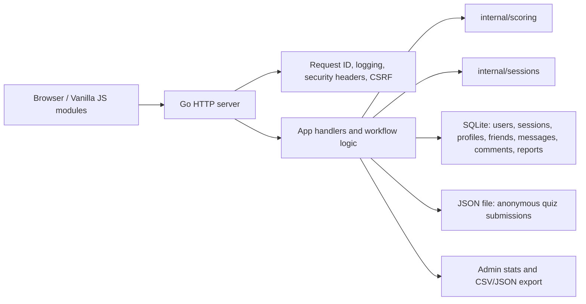

# Architecture

This project keeps a deliberately small stack: Go, `net/http`, vanilla JavaScript, SQLite, and JSON file storage.

## Packages

- `cmd/server`: production server entrypoint.
- `cmd/migrate`: applies SQLite migrations and exits.
- `cmd/seed`: inserts local-only demo users and results.
- `internal/app`: route wiring, handlers, workflow-level application logic, and app-facing stores.
- `internal/config`: environment parsing and production validation.
- `internal/http/middleware`: CSRF, security headers, and request IDs.
- `internal/platform/logging`: structured request logging.
- `internal/scoring`: MBTI scoring rules and validation.
- `internal/sessions`: SQLite-backed hashed session token store.
- `internal/storage/sqlite`: database opening, PRAGMAs, and embedded migration runner.

## Storage Design

Anonymous quiz submissions are written to `DATA_FILE` as JSON for simple demo/export workflows. Registered-user data uses SQLite: accounts, password hashes, sessions, profiles, saved results, friendships, profile comments, private messages, blocks, and reports.

SQLite is the source of truth for authenticated features. The JSON file is intentionally scoped to anonymous/admin-export quiz submissions.
