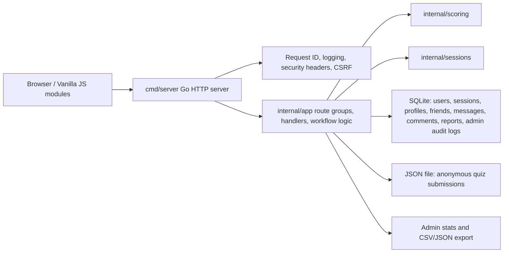

# Architecture

This project keeps a deliberately small stack: Go, `net/http`, vanilla JavaScript, SQLite, and JSON file storage.

## Packages

- `cmd/server`: server entrypoint.
- `cmd/migrate`: applies SQLite migrations and exits.
- `cmd/seed`: inserts local-only demo users and results.
- `internal/app`: route registration, handlers, workflow-level application logic, app-facing stores, admin audit logging, and JSON anonymous-result storage.
- `internal/config`: environment parsing and production validation.
- `internal/http/middleware`: CSRF, security headers, and request IDs.
- `internal/platform/logging`: HTTP request logging.
- `internal/scoring`: MBTI scoring rules and validation.
- `internal/sessions`: SQLite-backed hashed session token store.
- `internal/storage/sqlite`: database opening, PRAGMAs, embedded migration runner, and migration tests.

## Route Composition

Routes are grouped in `internal/app/handlers.go`:

- public: health, quiz submit, public profiles
- auth: user register/login/logout/me
- current user: profile and saved results
- social: friends, comments, messages
- safety: blocks, reports, admin report review
- admin: admin login/logout, anonymous results, stats, export
- static: frontend assets

This keeps the existing `internal/app` package stable while making the entry points easier to review. A larger production service could split handlers/stores into feature packages, but doing that here would create more churn than value.

## Storage Design

SQLite is the source of truth for authenticated features:

- users
- saved quiz results
- sessions
- friendships
- profile comments
- conversations and messages
- blocks and reports
- admin audit logs

Anonymous quiz submissions are written to `DATA_FILE` as JSON for simple demo/admin-export workflows. That JSON path is intentionally scoped to anonymous submissions and admin statistics/export.

## Migrations

- Reviewable SQL files live in `migrations/`.
- Embedded deployment copies live in `internal/storage/sqlite/migrations/`.
- Applied versions are recorded in `schema_migrations`.
- Migration tests verify ordering, idempotency, key tables, and sync between repository-level and embedded migrations.

## Security Boundaries

- Password hashing is in `internal/app/password.go`.
- Session token generation, hashing, lookup, expiry, and revocation are in `internal/sessions/store.go`.
- CSRF is enforced in `internal/http/middleware/csrf.go`.
- Security headers are in `internal/http/middleware/security.go`.
- Client IP handling and login rate limiting are in `internal/app/login_rate_limiter.go`.
- Admin audit writes are in `internal/app/admin_audit.go`.

## Current Trade-Offs

- `internal/app` is still broad because this is a small portfolio app. The low-risk cleanup was to group routes and keep response helpers explicit. A full package split is documented as future work rather than forced now.
- SQLite is great for clone-and-run review, but a high-write multi-replica production deployment should use a managed relational database.
- Single-password admin auth is acceptable for a demo reviewer panel, but production should use per-admin accounts, RBAC, and MFA.
- Observability is intentionally light: request logs and request IDs exist, but metrics/tracing are roadmap work.
